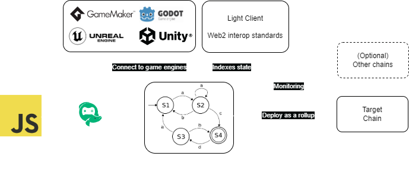
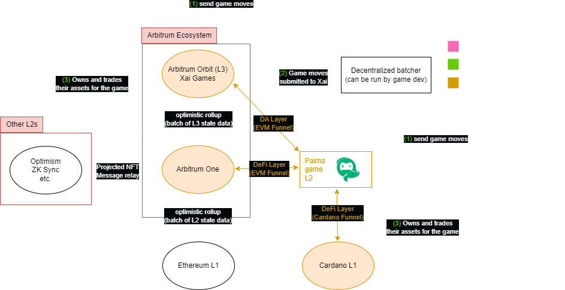
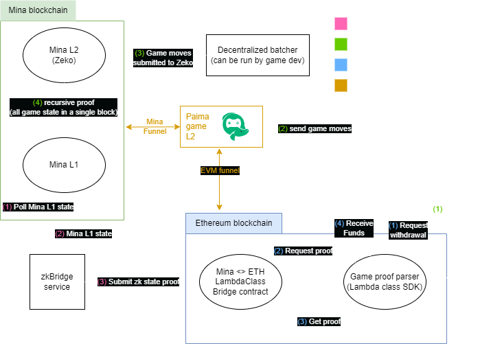

# What is Paima Engine?

Paima is a Web3 Engine optimized for games, gamification and autonomous worlds that allows building web3 applications in just days

Notably, its key features are that it
1. Allows building onchain games with web2 skills
2. Protects users even in the case of hacks allowing brands to build web3 applications without worrying
3. Enables cross-wallet gameplay, meaning you can deploy your game to one chain yet have it be playable from across many blockchains
4. Speeds you up to make weekly releases a reality instead of most web3 games which are release-and-pray

Paima supports any EVM chain, and comes with a rich feature set for multichain support as well.

# Key technologies that enable this

If you prefer explanations in video form, we have [a high-level summary video](https://www.youtube.com/watch?v=HtvemijxF-0) that explains some of the core benefits of Paima Engine.

## State machines as Sovereign Rollup L2s

Rollups come in many forms, each converting execution costs to storage costs in their own way:
- Optimistic rollups: run the calculation offchain, then store all the data required to execute the function (just data, no execution) along with your locally computed value for the result. Only actually run the execution if somebody believes the result you posted is incorrect ("fraud proof"). 
    *Popular examples: Arbitrum, Optimism*
- ZK rollups: run the calculation offchain, then store all the data required to execute the function (just data, no execution) along with your locally computed ZK proof of the result. 
    *Popular examples: ZK Sync, Starknet, Polygon zkEVM*
- Sovereign rollup: run the calculation offchain, then store all the data required to execute the function (just data, no execution). 
    *Popular examples: Rollkit, most infra for Bitcoin*

Paima is a framework for creating app-specific layer 2s (L2s) as sovereign rollups. That is to say: apps publish transactions to a blockchain for ordering and data availability, but uses its own code to determine the correct app state.

Another way to describe this is first to note that every mathematical function has 3 key properties:
1. Function inputs
2. Function definition
3. Function outputs

For Paima, the inputs are stored on-chain (which guarantees determinism), the function definition is packaged as an executable for running the app, and the function output is the resulting state machine after applying the transition (which can then be queried through an indexer)

You may sometimes hear this referred to as a "pessimistic rollup" because nodes need to re-execute transactions to check the validity of the chain instead of optimistically being able to assume correctness. This mirrors many ideas of [replicated state machines](https://en.wikipedia.org/wiki/State_machine_replication).

## Data Projections (co-processing)

These state machines can evolve based on L1 updates such as
- New blocks/transactions
- Contracts on the L1 being updated
- Accessing historical on-chain state
- Reading updates from other L2s/rollups deployed on the blockchain
- Passive time and timers (game ticks) \
Or even more complex transition rules.

In other words, it allows building event-driven (or sometimes called loop-driven) architectures. 

A great example of this is using the L1 blockchain as the source of randomness, which avoids every game having to re-implement a randomness oracle from scratch. Note that the data you can access through projections is actually more data than can natively be accessed by a smart contract (in fact, smart contract platforms usually very strictly limit the kind of data contracts can access). Co-processors are a growing field in web3 try and enable applications to bypass these restrictions to access more data and so in that way Paima Engine is a gaming-focused co-processor.

This is possible as sovereign rollups can project L1 state to the L2. A deep dive into data projections and the full modular gaming rollup stack [can be found in this video.](https://www.youtube.com/watch?v=t9En_PR3NCA) 

## Sharded rollups as a multichain co-processor

Paima allows you to do computation in your state machine over an aggregate view of multiple chains. This allows you to, in a sense, to shard the state of your application in multiple locations such as deploying your game to a cheaper chain yet still leverage NFT marketplace / DeFi liquidity from larger networks without requiring a bridge (since you are natively monitoring both chains). Note that this is done without giving up any sovereignty of your game logic. This is powered by having *data projections* from different networks aggregated into the same state machine. This allows your games to scale like DEX aggregators in the sense that they can leverage and aggregate features from multiple ecosystems to provide the best experience for their users.

## Stateful NFTs and NFT compression

Thanks to projections, we can access the state of L1 NFTs from Paima. We can then interpret the output of the state machine as extra information associated to these NFTs allowing them to evolve over time based on user actions on the L2.

In a sense, you can think of this as an NFT compression protocol. Instead of having to mint a lot of static NFTs on the L1, you can instead mint a minimal set of NFTs on the L1 and then evolve them based off the state of the L2.

## Parallelization (asynchronous compute) to handle over 10k+ tps per game

Paima state machine L2s are not only significantly more efficient than the EVM, they also supports optionally running state machine updates in parallel (not natively available in the EVM), allowing games and apps to massively scale by, for example, having different PVP matches or different maps in an MMO run in parallel.

## Cross-chain/multichain and sequencing with Paima Whirlpool

Natively Paima supports users individually submitting inputs onchain on the specific chain the app is hosted on. However, we also support more efficient setups that also work cross-chain with Paima Whirlpool - a suite of tools to help translate complex interactions to something that integrate seamlessly with Paima Engine.

### L2-level Account Abstraction

Currently there is a large focus on account abstraction which powers smart contract wallets to create systems more flexible than the default public-key wallets created by most cryptocurrencies.

Paima Engine can enable much more flexible account abstraction by providing this functionality at the L2 level when needed, which allows easily validating cryptographic primitives that would not otherwise be available at the L1.

### Based rollup & Sequencer SDKs

L2s created with Paima run as a [based rollup](https://ethresear.ch/t/based-rollups-superpowers-from-l1-sequencing/15016) - that is to say its sequencing is simply done by the DA layer (which is generally the underlying L1) and so it fully inherits its finality. This means that Paima L2s can be run without a sequencer (sometimes referred to as "self sequencing") and fully inherit the decentralization and security of the L1, and do this without the downsides traditionally associated with based rollups thanks to Paima's support for parallelization.

Although apps may not always need sequencers, they can still improve scalability and also help user onboarding. Notably, they can
- Batch transactions together to amortize transaction fees
- Cover the transaction fees for specified users through meta-transactions (ex: free txs for users who hold a specific NFT, who delegate to a stake pool, or who paid on a separate chain).

Thanks to the flexibility of the batcher system, Paima can even support games built without an enshrined sequencer - that is to say environments with multiple sequencers where anybody can choose to run their own decentralized sequencer for the game and monetize it how they want. This give the benefit of sequencing without the centralization or censorship concerns.

### Cross-chain NFTs: Projected NFTs

Projects may want to allow users to play games with NFTs hosted on chains separate from where the app was deployed. For example, the game is deployed on a DA layer, but is playable from NFT living on separate L1.

The goal, therefore, is to try and support connecting these NFTs to state machines in different ways with different trade-offs to empower games to take advantage of approach that works best for them. Notably, we are actively working on integrating:
- Multi-layer monitoring (Sharded rollups mentioned above)
- Storage proofs
- Mirroring
- NFT bridging
- Message passing

However, given that no system is instantaneous (even when monitoring multiple chains as different chains have different block times and finality), we need special handling when we need to assert the user still holds the NFT (in other words, they haven't sold the NFT since the last time we got an update from the different chain about the ownership status). To enable this, we have built a way to time-lock their NFTs (self-custodial) which gives the game time to detect if the user is trying to move their NFT. 

You can find more about the idea [here](../700-multichain-support/1-projected-nfts/1-introduction.mdx)

## Non-custodial L2s

Most blockchain apps and L2s are custodial in nature. That is to say, to use them you first have to deposit your funds into the app/L2. This is dangerous because it means that user funds are at risk if the contract that is custodying user funds gets hacked, or if the L2 goes offline (sometimes called a "proposer failure" if nobody can bridge L2 funds back to the L1, or "sequencer failure" / "liveness failure" if the L2 state itself can no longer be advanced).

Paima however, thanks to its projective rollup support, can allow users to keep full custody of their assets while using games & apps written using Paima. That is to say, even if your app gets hacked or all batchers for a game go offline, user L1 assets are not at risk. This makes Paima a very safe way for brands to deploy onchain applications and brand reputation risk in the case of a hack is minimal. Technically speaking, it means liveness is ensured thanks to self sequencing and proposer failures are simply not possible as there is no need for proposers in the first place.

Additionally, this also helps a lot with user acquisition as empirically most users are not comfortable bridging their NFTs from L1→L2 due to bridge security concerns.

Lastly, it also helps with liquidity & composability, as its means you don't have to fracture assets between L1 and L2.

## Financing of decentralized games

Although Paima allows games to subsidize gameplay, games can also choose to specify that users must pay a fee to submit moves in-game (the standard business model for L2s). This allows DAOs to gain funding to drive development of their game or app.

## Example game

To help visualize how these components help build a game, we will show an example game that settles to an Arbitrum Orbit L3 (Xai Games) as its DA layer as it uses a data availability committee making data cheap. However, since almost no users have assets on Xai, it uses Paima's built-in batcher (sequencer) SDK and account abstraction layer to allow players to play gasless from other chains.

Similarly, to give additional liquidity for NFTs for the game, it natively supports minting NFTs on the two of the largest ecosystems in crypto by marketcap (Ethereum through Arbitrum One and Cardano). Since there are many EVM ecosystems and we cannot possibly monitor them all, we use a projected NFT contract connected to a message relayer to support NFTs on the other chains (more on this topic in a later section).

## Ongoing work

### Data availability layer support

Paima, by default, uses EVM both as the settlement and Data Availability (DA) layer. However, some games may want to separate these concerns by using a different layers for settlement and DA (either as a volition or a validium)

To enable this, Paima will facilitate storing state machine inputs on a DA layer, significantly lowering costs for data-hungry use-cases. We plan to integrate Avail and Celestia for this

### ZK (Zero-Knowledge Cryptography)

ZK cryptography is often used in Web3 for two different properties:
- Its ability to succinctly prove the state of a system (kind of like a very efficient compression system)
- Its ability to handle functions with private inputs

Both these use-cases are of interest in games, as being able to prove world state helps with composability of worlds, and private inputs allow games with private state (ex: fog of war) and can also help with compliance (ex: being able to prove you know information without revealing the sensitive information publicly)

Paima is working with [Zeko](http://zeko.io/) (based on Mina Protocol) to implement its first ZK Layer

#### Example game

This game is a team battle game that leverages recursive SNARKs provided by the Mina blockchain for private state and state-channel-like scalability. However, Mina has very few users. To get around this issue, it allows users to deposit funds into the game from Ethereum and unlocks winnings using a ZK proof of victory. However, since ZK proofs only settle to Ethereum once a match is over (plus a few minutes of overhead). To allow writing a smooth UX where the whole game logic is a unified experience, the game is written using Paima Engine that monitors both Mina for the gameplay and Ethereum for the deposits and payouts.

### State Channels (Short-lived Shards)

Paima's parallelism feature already serves as the first step towards a future system to have game shards to help games scale as needed. These shards could be long-lived, or be ephemeral such as state channels that facilitate use-cases like 5v5 fights where a state channel could be opened between participants and settled when the game is over.

### AI

A few common demands have emerged for integration of AI into autonomous worlds:
- Affecting the appearance of user's NFTs
- Affecting the game world state (either as NPCs like in [Smallville](https://www.youtube.com/watch?v=aIDSmgsT4p8) or as a god that controls the world)

Since autonomous worlds do not necessarily have a central company driving the evolution of a game, this kind of autonomous action powered via AI and LLMs is an interesting alternative. However, since AI is not something that can be run computationally onchain, the AI is often run similarly to a sovereign rollup - as a uni-directional bridge. This is not ideal as it means you cannot "close the loop" by having the AI result come back and modify the in-game world.

Paima is tackling both of these use-cases:
- Paima already supports basic deterministic AI integration and you can see an example of this in a proof-of-concept game called [Oracle RPG](https://github.com/dcSpark/paima-ai-text-adventure) where user Stateful NFTs dynamically evolve based on AI computation
- We hope to expand AI support to allow more complex use-cases such as villages powered by AI agents that hold Stateful NFTs. This will be done through integration with [Shinkai Network](https://twitter.com/shinkai_network).

### P2P layer

Currently, Paima works by updating the world based off on-chain transactions. However, a P2P layer between players could improve the experience.

Notably,
1. Currently, the game tick rate to that of the underlying chain (1~2 seconds on many L1s/L2s). In the future, we will build a way to connect Paima games to a P2P layer so that transactions can be broadcast between users faster than it takes for the txs to appear on-chain, allowing for a faster experience assuming players have honestly submitted their transactions (optimistic updates).
1. Users want to send visual updates to each other that do not be to settled on-chain, such as chat boxes.

### Commit-reveal

Currently, for most commit-reveal schemes, users have to be online to make the reveal. In online games where everybody has 24hrs to commit their next move, this is not ideal as it means all players need to come online at the end of the round to reveal their move.

Solutions for this problem often involves more complex cryptography and too many "reveal" transactions to scale properly. However, Paima can very naturally integrate [decentralized timelock encryption protocols](https://www.youtube.com/watch?v=z7wSFe5t7nc) for games that need it.

# Why Sovereign rollups?

There are a few ways of powering scalable applications on-chain. Paima is built using Sovereign Rollups instead of two other common techniques: Optimistic Rollups and ZK Rollups

## Optimistic Rollup disadvantages

This section is written assuming an EVM-based optimistic rollup

1. Apps have to be written in Solidity (if deploying to an existing optimistic rollup like Arbitrum) or be written to be compatible with the fraud-proof system (if an app-chain) which limits flexibility and generally means it's not composable with standard game development tools
1. App performance is bottlenecked by EVM performance. Even implementing parallelization (very common for games) requires a complex sharding system, greatly increasing ecosystem complexity.
1. Limited to EVM's data model (reads and writes are slow)
1. No support for passive time, as you cannot fraud-proof the passage of time. However, passive time is hugely important for games (ex: timers)
1. Requires Solidity boilerplate (not accessible to most game developers)
1. Limited projection and stateful NFT support (optimistic rollups have limited projective rollup support). This limits the user base as many users will not want to bridge their NFTs from L1→L2 to use the app and also hurts liquidity & composability
1. Apps have very long finality as they may get rolled back due to fraud proofs

## ZK Rollup disadvantages

ZK Rollups are primarily a computation solution. Although handling computation is important, a lot of apps (especially games) are more data management platforms (user accounts, encoding how the accounts update over time, etc.). Therefore it often makes more sense to have a sovereign rollup as the base for the game, and only use ZK when required on specific parts of your app (such as associating ZK proofs to stateful NFTs that may represent things like results of a match)

If ZK is enforced or if the whole application needs to be written as one giant ZK circuit, you will run into the following issues:

1. ZK performance is generally slow for large circuits, making it very hard to build complex games
1. ZK platforms typically enforce a global maximum on circuit sizes for zkApps deployed to their platform, which complex games will exceed
1. ZK circuits are currently still hard to write. There are some languages and efforts to simplify this, but they generally still require manual fine-tuning to try and minimize circuit size as much as possible
1. No support for passive time. This may be, depending in the use-case, replaceable by a Verifiable Delay Function, but this is much more complicated and not as powerful

## Sovereign Rollup disadvantages

Unfortunately there is no "free lunch", and so usage of Paima comes with some disadvantages as well.

### Trickier DeFi support on the L2

Although assets that stay on the L1 are supported, if assets are stored on the L2 it is difficult to trustlessly bridge from the L2 back to the L1 (that is to say, supporting the ability to put \$5 into the L2, make some money, then take \$10 out require extra work). This isn't a requirement to build in-game economies, and this also isn't required for the overwhelming majority of non-DeFi applications and so it's not as problematic as one might think.

If you do want this functionality, there are three key ways to do it:
1. Provide a centralized "redemption" service. For example, if you build a casino with Paima, players would play the game with chips, and then would turn their chips back into money through a centralized redemption service (that possibly does KYC). This is no different than the way the overwhelming majority of casinos work in the real world.
2. Simply don't bridge the asset to the L2. Even if the user funds stay on the L1 (non-custodially), you can project the state into the Paima game, which means you can still build in-game economies. In fact, building it this way is significantly safer as it means user funds are not at risk if your game gets hacked!
3. Write your games using ZK circuits with Zeko or any other ZK layer tha Paima plans to support (in other words, write your game as a zk co-processor)

### Low compatibility with other L1 dApps by default

Paima gains a lot of its strength from shifting game state management into the L2, which cannot be read from other L1 dApps by default. We think this is actually a benefit though, as it avoids web3 developers making the single most common mistake in web3 games: overly focusing on compatibility when they do not have a product-market fit yet.

That is to say, Paima allows you to start by building your entire app / game on the L2 and then, once you know users love the experience, you can migrate parts of your game state to the L1 (which requires you to write it in the L1 language like Solidity) and then projecting its state to the L2. This makes bootstrapping your game significantly faster, cheaper, safer, and makes it easier to update. Only focus on compatibility once users love your system and truly desire connecting it with other experiences.

### Trickier cross-game indexing

Unless the game is built as one giant recursive SNARK circuit, it is hard to succinctly prove a summary of game state. Additionally, unlike optimistic rollups, it's harder to leverage any L1 light client infrastructure to prove game state. This is a consequence of Paima being a pessimistic rollup by default.

This makes it harder to do things like peer-discovery of RPC nodes for a game and build cross-game indexing services like a platform to see all achievements earned across games written with Paima. We do, however, have some standards planned to help alleviate this issue.

# Architecture overview

See [this page](https://paimastudios.com/paima-engine) for more.
