# Connect Wallet To Test

When you deploy your game to production, of course you can use whatever wallet system you want to interact with your application.

The steps below, however, are to make connecting a wallet to your local network as you test a breeze.

## A Note on Browser Profiles {#profiles}

To avoid making a mistake, it's usually best to have a special environment you use just for testing (that you never connect you main wallet to).

Chrome has a great features that allows creating multiple profiles in your browser -- each with its own totally separate browser storage and separate browser extensions. It makes it easy to create a "test" profile for setting up wallets.

Learn more [here](https://support.google.com/chrome/answer/2364824?hl=en&co=GENIE.Platform%3DDesktop).

## (Recommended) Using Rivet

[Rivet](https://chromewebstore.google.com/detail/rivet/mobmnpcacgadhkjfelhpemphmmnggnod) is a browser extension wallet optimized for developers who are testing making it perfect for developing with Paima Engine.

### Step 1: Download Rivet {#rivet}

You can download it [here](https://chromewebstore.google.com/detail/rivet/mobmnpcacgadhkjfelhpemphmmnggnod).

If you're running a special environment other than Chrome, refer to the [Rivet docs](https://github.com/paradigmxyz/rivet)

### Step 2: Run your game UI and open it in your browser

Unlike other wallets, Rivet does nothing on regular web pages (you cannot tap it like MetaMask). See [here](./1-how-to-use-paima-engine.md) if you need help on getting your game running

### Step 3: Go through the Anvil setup

Once you've opened the frontend for your game, you'll see Rivet appear on the screen. We'll walk you through the setup steps.

#### 1. Press the `Create Anvil instance` (it doesn't matter that you're not actually running Anvil. You don't need to know what it is).

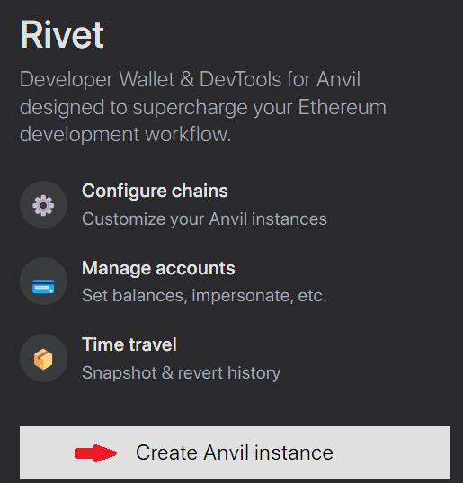

#### 2. Ignore the instructions and just press "Continue"

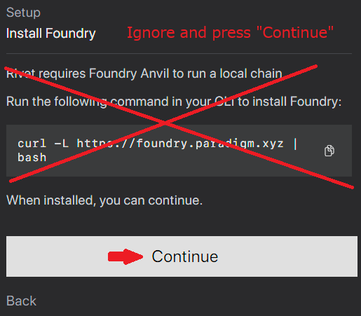

#### 3. Configure the options to match your `hardhat.config.ts` for your game (you can find this in the template you downloaded for Paima)

- Chain ID `31337`
- Network Name `Hardhat`
- RPC URL `http://localhost:8545`
- Block Number `1`
- Block Time `2`

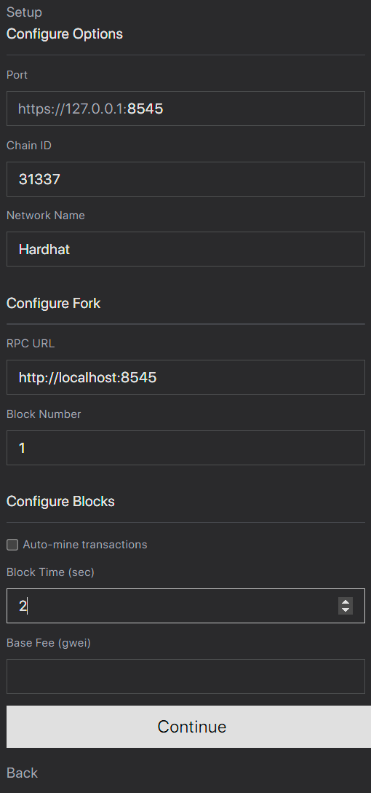

#### 4. Approve the request to connect to localhost

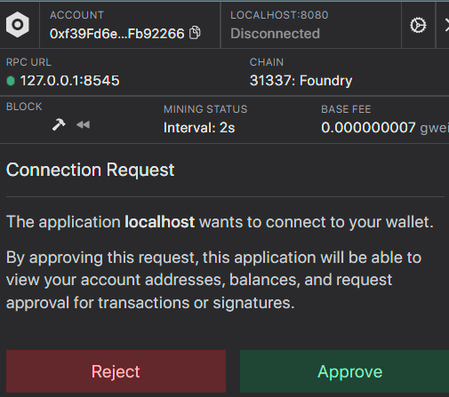

#### 5. (optional) Take it all in

You should now get significantly more detailed views of the transactions for your game, and you can also see all the transactions, addresses and contracts deployed to your local network.

Note that Rivet uses addresses automatically generated for your local network. These addresses are **for testing purposes only**. You should NEVER use them on a real network (these are not your addresses magically imported from MetaMask or elsewhere. They are publicly known addresses that anybody can reuse).

Some features of Rivet will crash (just refresh the page if this happens). This is happens because Rivet was originally designed for [Anvil](https://book.getfoundry.sh/anvil/) which is a different tool for managing local networks (and we're using [Hardhat](https://hardhat.org/) instead). Fortunately these tools are compatible enough that things mostly work.

#### 6. (optional) Setup auto-signing

If you don't want to manually approve every transaction for your application, and don't want to setup Paima's [account abstraction layer](../700-multichain-support/2-wallet-layer/1-introduction.mdx) just to play around on a test network, Rivet comes with a functionality to auto-sign transactions for you.

Just open the settings icon at the top-right and check the two boxes seen below (or all three if you're following our recommendation to use  [browser profile just for testing](#profiles) ). **Note**: this is only safe because we're doing this on a local network. Do not do this with a real wallet on a real network.

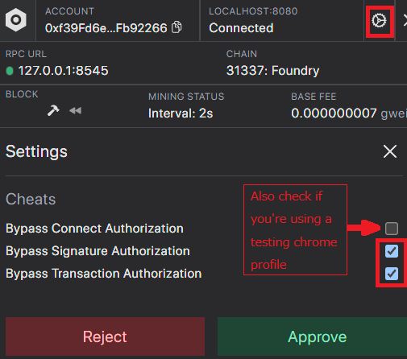

## (Not Recommended) Using MetaMask {#metamask}

[MetaMask](https://metamask.io/) is a popular browser extension wallet. Although it works okay for mainnet, it is not optimized for developer usage on networks running locally. We'll show your the steps on how to get it working despite this, but we recommend [Rivet](#rivet) if possible.

Key points to keep in mind:
1. These steps are **only required if running on a localhost network** (not required on mainnet / testnet)
2. You will need to reset your nonce often for this by going to `Settings > Advanced > Clear activity and nonce data`

There are two ways to connect MetaMask to your local network

### Option 1:`Hardhat Private Key → MetaMask`

#### 1. Open MetaMask and click on the account selector at the top of the screen

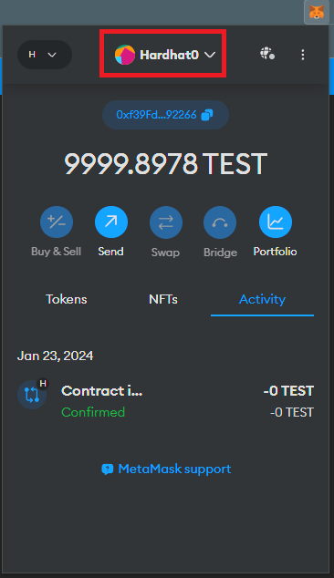

#### 2. Click "Add Account" at the bottom

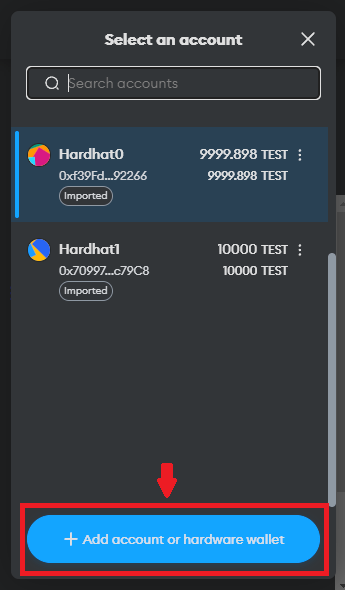
3. Click "add account"

#### 3. Select "import account"

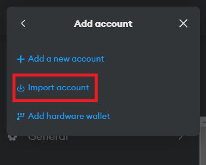

#### 4. Paste in the private key seen when running `npm run chain:deploy`

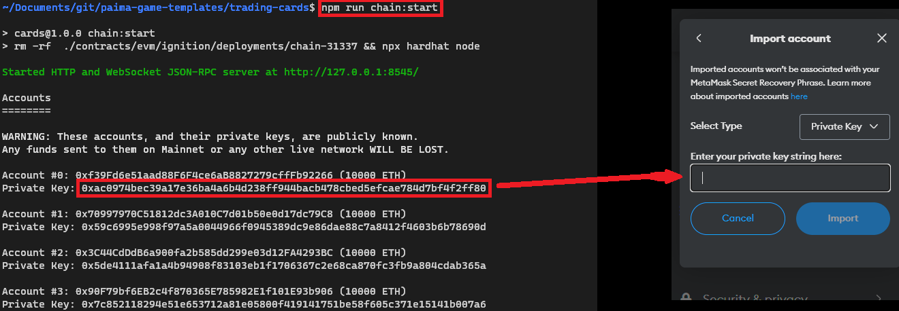

### Option 2: `MetaMask mnemonic → Hardhat`

See the MetaMask guide for this [here](https://docs.metamask.io/wallet/how-to/get-started-building/run-devnet/)

### **Important** MetaMask Issue

The main issue with MetaMask is that it will not automatically detect if your locally running network got reset. This is problematic because in EVM, every transaction made by an account has an ID that needs to be a continuously increasing value (learn more [here](https://help.myetherwallet.com/en/articles/5461509-what-is-a-nonce)), and so if you restart your local network MetaMask will use the wrong ID and **your transactions will fail** silently.

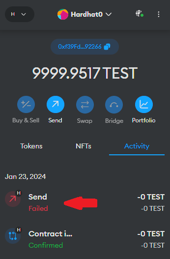

To solve this issue, follow the steps below **every time** you restart your local network.

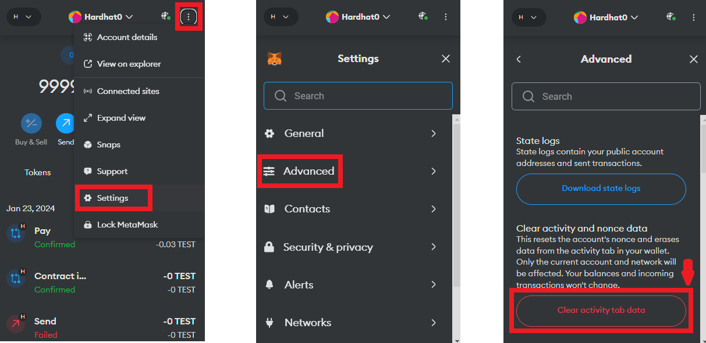

[Rivet](#rivet) does not have this issue and refreshing the page is generally sufficient.
