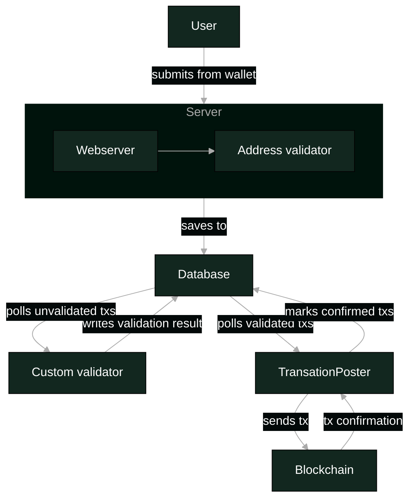

# Batched mode

Paima supports two different modes for inputs:
1. Non-batched mode. This only supports EVM wallets set to the same network as used for the settlement layer of the app. Transaction are submitted directly by the user (and they cover the transaction fees)
2. Batched mode. Users sign data, and transactions are crafted by the batcher. This allows users to use the app with different EVM networks or wallets from different cryptocurrencies.

We protect batched mode users by calculating `sign(securityPrefix || input || timestamp)` where:
1. `securityPrefix` is described [here](./7-autosign.md)
2. `timestamp` is used for replay protection. You can learn more about replay protection [here](./6-replay-protection.md)

The idea behind it is that rather than each user submitting their own transactions directly on-chain, instead they:

1. Create a valid game input.
2. Sign the payload with their private key.
3. Provide the game input + signature + their address to a batcher.
4. The batcher compiles the signed game inputs of many users and submits one "batched game input" transaction the contract.

## Paima Engine Support

One of the great things about game input batching is that we can support it on the level of Paima Engine such that every game will be able to automatically get to take advantage of it for free. Furthermore, the implementer of a game state machine does not even have to consider batched game inputs (besides the fact that address types may vary if supporting other L1s).

Specifically, Paima Funnel will handle unbundling the batch for you so that each entry inside the batch will be treated as if it was an individual input from the perspective of your app (technically speaking, the single `submittedData` that contains the entire batch will be split such that each entry inside the batch will be its own `submittedData`).

In order for this to be secure, while processing a batched game input transaction Paima Funnel verifies every signature matches for every game input supplied. If not, then that game input is thrown away. As such, when constructing a `submittedData`, the address will be verified and can be trusted if they end up inside your app (of note, in regular submitted game input this signature validation is performed by the blockchain validators who verified the tx before it was added to a block, so now we have to do it instead). Thus the game state machine will be able to trust the authenticity of all `submittedData`, whether or not they came from batched game input txs, and not have to even consider how they were submitted.

## Batched Input Format

We will specify a standard batched input transactions are required to follow in order to be considered valid.

```
B~
userAddress/userSignature/input/millisecondTimestamp~
userAddress/userSignature/input/millisecondTimestamp~
userAddress/userSignature/input/millisecondTimestamp~
```

Key notes:
- `B` is used to denote this is a batched game input transaction. It is simply the ASCII character `B`.
- `~` in practice is actually the `\x02` ASCII character
- `/` in practice is actually the `\x03` ASCII character

## Architecture

The diagram below lays out the general architecture of Paima Batcher.



### Batcher Webserver

The batcher webserver is the external facing webserver which allows users to interact with the batcher. The primary functionality of the web server will be to allow users to submit their game inputs to be batched, however eventually the web server will also expose endpoints related to user status (ie. telling the user how many more game inputs, or days they have paid for/still available).

### Address Validator

The address validator is the module which dictates whether or not a user(address) is allowed to have their game input batched (returns a true/false to the webserver after the user submits their game input to let the user know whether it was accepted). The address validator checks:

1. Whether the address is one of the supported address schemes.
2. Whether the submitted game input matches the signature supplied with it.
3. Whether the address is allowed to submit game input to the batcher.

If the address validator returns `true` for the user of the submitted game input (meaning the user has the right to submit their game inputs to the batcher) then it also adds the game input into the `unvalidated_game_inputs` table of the database (ordered by an ever-increasing id as primary key).

Initially we will allow any address to batch their game input for free, but will add the ability for the address validator to rate limit users based on number of game inputs submitted and/or number of days they are allowed to submit as many game inputs as they wish (and then rate limiting on how fast they can submit them). This rate limiting will eventually be tied to external data (ie. whether someone owns an NFT, is staking, or made an in app purchase on mobile, etc.).

The address validator is used by the webserver on the same coordinating thread.

### Game Input Validator

Each deployed batcher will specify which game input validator it is using (with the expectation that for each game we will implement a custom validator). The game input validator reads inputs from the `unvalidated_game_inputs` table and verifies that:

1. The user submitted game input is formatted properly.
2. For game inputs with a state identifier (`|*`), checks a running game backend to ensure that said piece of state actually exists (ex. that someone is joining or submitting moves to a match that is not fake).

If these checks pass, then the game input is added to the `validated_game_inputs` table (ordered by an ever-increasing id as primary key). If the checks do not pass, then the game input is thrown away. In either case, it is also deleted from the `unvalidated_game_inputs` table.

The validator runs on a distinct thread/process and only interacts with the database. In the future we can think about parallelizing game input validation if this ever becomes a bottleneck.

### Batched Transaction Poster

The batched transaction poster reads inputs from the `validated_game_inputs` table and produced a batched transaction which gets submitted to the on-chain game smart contract that the batcher is targeting. Once the transaction has been submitted and confirmed, the poster deletes the inputs which from the `validated_game_inputs` table.

The poster runs on a distinct thread and only interacts with the database and the on-chain contract.

### Batcher Runtime

The batcher runtime is the coordinating top-level module which:

- Starts the webserver on its own thread
- Starts the game input validator on its own thread
- Starts the batched transaction poster on its own thread
